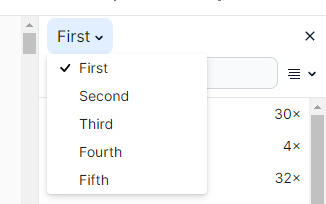
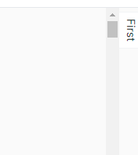

# Getting started:

1. Clone/fork this repo;
2. Run `npm install`;
3. Run `npm run dev` to start the local server and navigate to [http://localhost:3000/](http://localhost:3000/) to browse.

Additionally, other scripts are available:

-   `npm run eslint` and `npm run eslint:fix` to run ESLint to check code conventions, and have ESLint attempt to fix issues that can be automatically fixed;
-   `npm run typecheck` to run TSC to compile ts code and report errors;
-   `npm run format` and `npm run format:fix` to run Prettier to check formatting conventions, and have Prettier attempt to format it when possible;
-   `npm run build` to have Remix package the app.

# Current scenario:

Application built using TypeScript, [Remix](https://remix.run/) and [Tailwind](https://tailwindcss.com/), and its conventions:

-   [/app](./app/) contains the application code;
-   Each file under [/app/routes](./app/routes/) is a page. Currently, [/app/routes/index.tsx](./app/routes/index.tsx) maps to [http://localhost:3000/](http://localhost:3000/);
-   [/components](./components/) contains individual React components;
-   [/app.css](./app.css) is the base out of which Tailwind generates the CSS for the app. Although it can be used to create css classes for the entire app, Tailwind conventions suggest specifying classes as part of the components JSX.

Side panels are implemented in the app. They are fixed, may be placed on either side of the main content area, and currently only one side panel may exist in either side. Each side panel may have a title, and will render its children.

# Task:

Improve the side panels:

1. One or more side panels may be specified on either side. Only one panel may be shown at a time, and to switch between them a dropdown should be rendered in its title, listing the available panels for that side.

    

2. They may be closed, in which case only a small button rotated 90 degrees will be shown to reopen the last panel used in that side, and should allow the main content area to expand. While open, a 'X' button should appear aligned to the right side of the title to close them.

    

3. Content in the main area may contain links or buttons that cause a specific panel to be programatically opened when clicked.

# Goals:

1. Create a `PanelGroup` component to maintain panels for either side.

    - It should have a `side` prop to specify which in which side they will be shown, and an `active` prop to specify which panel is currently active in that group.
    - The group should display the current active panel, or a button to open it in case it is closed.
    - The group should allow specifying multiple panels for its `children`, and should keep track of its state (which panel is active, and whether the group is open or not);

2. Improve the existing `Panel` component to implement those requirements.

3. Implement a mechanism to allow a button or link in the main content area to set the current active panel for either side.

# Notes:

-   Feel free to ask questions!

-   `Panel` component may be modified so as to remove something from it. Given that there will be a `PanelGroup`, does each `Panel` need to render its title?

-   Would it be possible to store the current active panel of each group so that it remains active across page reloads?

-   Would it be possible to specify in which side a panel should be rendered in, so that a panel may be moved from one side to the other? How would you implement it?

-   Would it be possible to let the user resize each group? How would you implement it?

-   Would you do anything differently?
